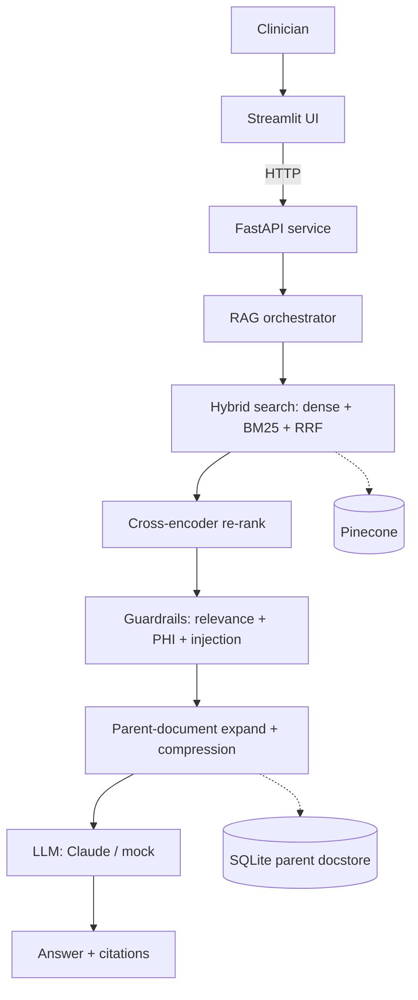

# Tenet Clinical AI - Grounded Clinical Knowledge Assistant (RAG)

An internal **Retrieval-Augmented Generation (RAG)** assistant that lets clinicians
ask natural-language questions and get answers **grounded strictly in source
documents** (physician notes, discharge summaries, lab reports), **with citations**
and a safe *"I don't know"* when the answer isn't in the documents.

> All documents are **synthetic** - no real patient data (PHI). This is a
> portfolio/learning project, not a medical device or medical advice.

---

## Why it exists

Clinicians lose time manually searching unstructured documents, and a plain
chatbot is unsafe (it hallucinates). This system retrieves the relevant text by
**meaning**, generates an answer **only** from that text, cites its sources, and
refuses when the information isn't present.

## Architecture



## Features

- **Advanced retrieval:** hybrid search (dense **BGE** embeddings + **BM25**),
  **Reciprocal Rank Fusion**, **cross-encoder re-ranking**, **multi-query**,
  **contextual retrieval**, **contextual compression**, **parent-document**
  (children in the vector DB with a `parent_id`, parents in a SQLite docstore).
- **Vector DB:** **Pinecone** (managed, serverless) with a local in-memory fallback.
- **Grounded generation:** Anthropic **Claude** (with an offline mock), citations,
  structured output, and streaming.
- **Conversational:** per-session memory + follow-up condensing + **semantic
  long-term memory**.
- **Agent:** a **LangGraph** tool-routing agent (search / summarize / list).
- **Safety:** relevance-threshold refusal, **PHI/PII redaction**, prompt-injection
  guardrail. **Performance:** semantic cache.
- **Evaluation & ops:** retrieval metrics (Hit-rate, MRR), RAGAS-style generation
  metrics, **MLflow** tracking, **LangSmith** tracing, `/metrics` monitoring,
  structured logging, **pytest** suite, **Docker**, **GitHub Actions** CI.

## Tech stack

Python · FastAPI · Pydantic · uvicorn · LangChain · LangGraph · LangSmith ·
Anthropic Claude · Hugging Face · sentence-transformers (BGE) · PyTorch ·
cross-encoder reranker · LoRA/PEFT · Pinecone · BM25 · SQLite · scikit-learn ·
MLflow · Streamlit · Docker · GitHub Actions · pytest.

## Project structure

```
tenet-clinical-ai/
  app/
    main.py                 # FastAPI app (lifespan ingests on startup)
    config.py               # settings from .env
    api/routes.py           # endpoints
    schemas/models.py       # request/response models
    services/               # embedding, vector, keyword, retrieval, rerank,
                            # rag, llm, guardrails, cache, memory, conversation,
                            # agent, parent, compression, monitoring, eval
    utils/                  # text_utils, logging_utils, tracing
  data/                     # synthetic clinical documents
  scripts/                  # generate_sample_data, debug_ask, evaluate, track_experiments
  tests/                    # unit + integration
  notebooks/                # ML lesson notebooks + LoRA fine-tuning (Colab)
  docs/                     # architecture, guides, resume points, interview notes
  streamlit_app.py          # frontend UI (calls the API)
  Dockerfile / .dockerignore
  requirements.txt / .env.example
```

## Setup

```bash
# 1. Create and activate a virtual environment
python -m venv .venv
.venv\Scripts\activate            # Windows  (source .venv/bin/activate on Mac/Linux)

# 2. Install dependencies
pip install -r requirements.txt

# 3. Configure environment
copy .env.example .env            # then edit .env
```

### Environment variables (`.env`)

| Variable | Purpose |
|---|---|
| `APP_MODE` | `offline` (mock LLM, no key) or `online` (real Claude) |
| `LLM_API_KEY` | Anthropic API key (only for online mode) |
| `LLM_MODEL` | e.g. `claude-sonnet-5` |
| `VECTOR_BACKEND` | `local` (in-memory) or `pinecone` |
| `PINECONE_API_KEY` | Pinecone key (for pinecone backend) |

`.env` is git-ignored - never commit real keys. `.env.example` is the safe template.

## Generate sample data

```bash
python scripts/generate_sample_data.py     # writes synthetic docs into data/
```

## Run

**Backend API** (terminal 1):
```bash
uvicorn app.main:app --reload              # http://127.0.0.1:8000  (docs at /docs)
```

**Frontend UI** (terminal 2):
```bash
streamlit run streamlit_app.py             # http://localhost:8501
```

> Tip: set `APP_MODE=offline` to run fully free/local (mock answer-writer).

## Tests

```bash
pytest -q
```

## API endpoints

| Method | Path | Description |
|---|---|---|
| GET | `/health` | liveness + mode |
| POST | `/ingest` | load documents |
| POST | `/search` | hybrid search (chunks) |
| POST | `/ask` | full RAG (answer + sources) |
| POST | `/ask/structured` | JSON {answer, confidence, sources} |
| POST | `/ask/stream` | streamed answer |
| POST | `/chat` | conversational (memory) |
| POST | `/agent` | tool-routing agent |
| GET | `/metrics` | monitoring metrics |

### Example

```bash
curl -X POST http://127.0.0.1:8000/ask \
  -H "Content-Type: application/json" \
  -d '{"question": "What follow-up care was recommended?", "top_k": 3}'
```

## Docker

```bash
docker build -t tenet-clinical-ai .
docker run -p 8000:8000 --env-file .env tenet-clinical-ai
```

## Cloud (conceptual)

Ingestion runs as an offline job upserting into Pinecone; the API is
containerized and deployed (e.g. AWS ECS/EKS) behind a load balancer, with
secrets from a secret manager and metrics scraped by Prometheus/Grafana. See
`docs/production_notes.md`.

## Limitations

- Synthetic data; small corpus.
- Conversation memory, cache, and monitoring are single-instance (in-memory) -
  production moves them to Redis/Prometheus (see `docs/production_notes.md`).
- RAGAS is approximated offline with embeddings; production uses an LLM judge.

## Future improvements

Redis-backed state, LLM-graded RAGAS, stronger reranker (bge-reranker/Cohere),
fine-tuned domain embeddings, Llama Guard + Presidio for safety, Kubernetes +
Terraform deployment.

## Docs

- `docs/production_rag_guide.md` - full RAG techniques
- `docs/layers_and_options.md` - every layer + technology options
- `docs/method_flow.md` - method-by-method call chain
- `docs/production_notes.md` - what's production vs simplified
- `docs/interview_screening.md` / `docs/resume_points.md` - interview prep
```
