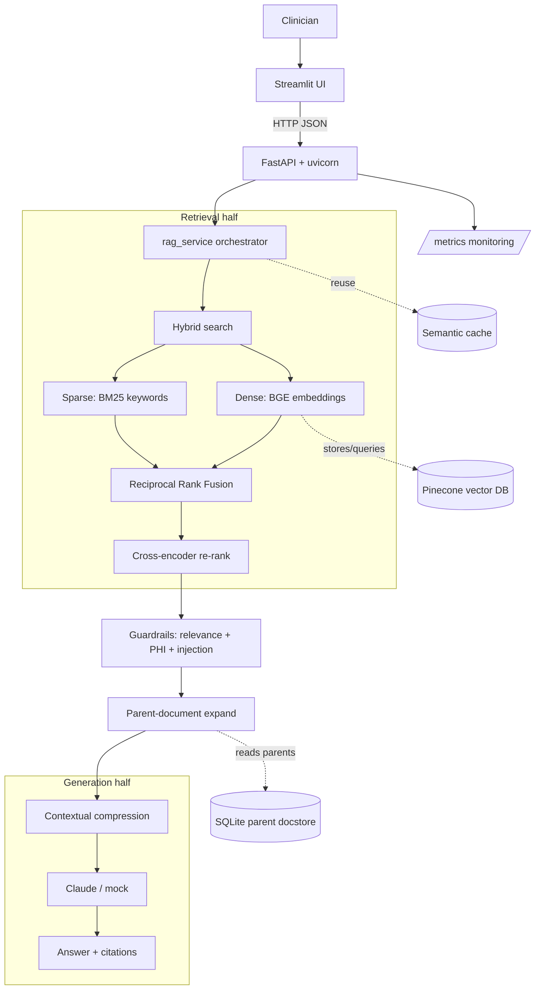
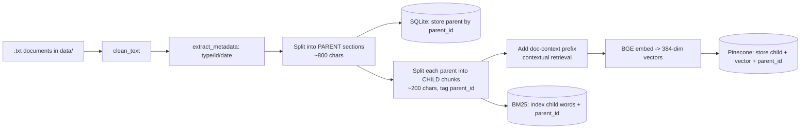
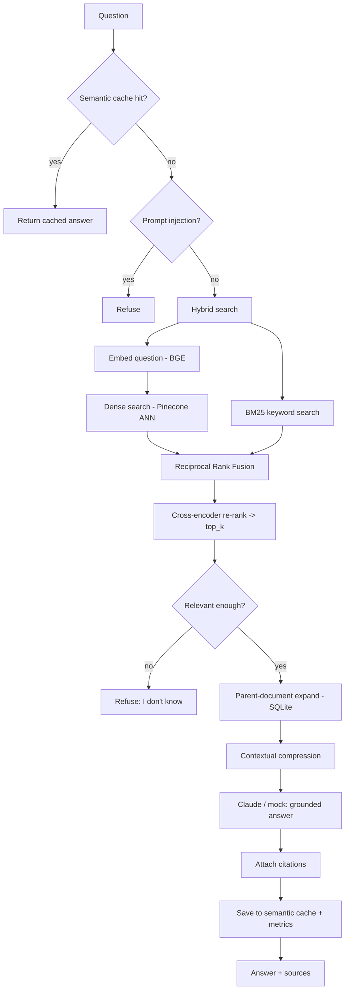
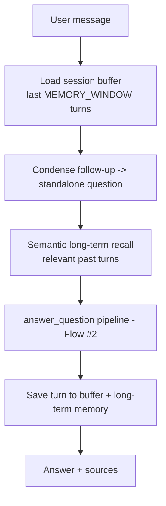
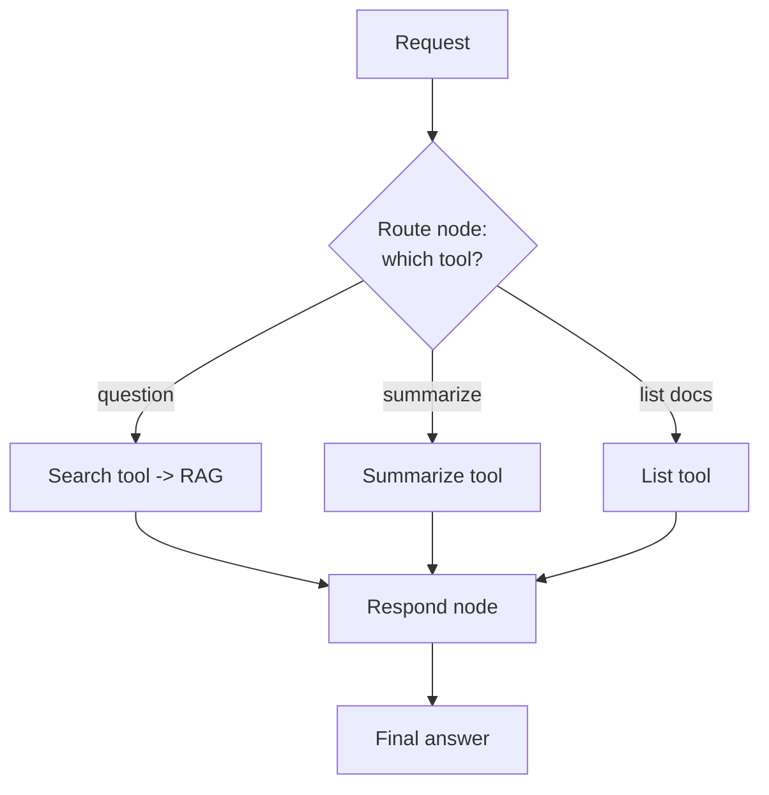

# Clinical Assistant — Complete Project Overview

A single, teaching-style walkthrough of the whole project: **what it is**, **what
it does**, **every technology used (and why)**, and **how a question flows through
each technology, step by step**, with flowcharts.

> All documents are **synthetic** — no real patient data (PHI). This is a
> portfolio/learning project, not a medical device or medical advice.

---

## 1. What is this project?

**Clinical Assistant** is a **production-style Retrieval-Augmented Generation (RAG)**
system. Clinicians ask natural-language questions (e.g. *"What follow-up care was
recommended?"*) and get answers that are:

- **Grounded** — written *only* from the source documents, not the model's memory,
- **Cited** — every answer lists the documents it used,
- **Safe** — it says *"I don't know"* when the answer isn't in the documents, and
  it blocks prompt-injection and redacts PHI.

### Why RAG (and not just a chatbot)?
A plain LLM **hallucinates** — it makes up plausible-sounding but wrong facts. That
is unacceptable in healthcare. RAG fixes this by **retrieving the relevant text
first**, then asking the LLM to answer **using only that text**. The model becomes
a careful *reader/writer* over trusted documents, not a guessing machine.

---

## 2. What does it do? (Features)

| Feature | What it means |
|---|---|
| **Hybrid retrieval** | Finds text by **meaning** (embeddings) **and** by **keywords** (BM25), then fuses the two rankings. |
| **Re-ranking** | A second, more accurate model re-scores the shortlist so the very best chunks go to the LLM. |
| **Parent-document retrieval** | Searches tiny precise chunks but feeds the LLM the larger *section* they belong to (more context). |
| **Contextual retrieval** | Enriches each chunk with its document context *before* embedding, so isolated chunks keep their meaning. |
| **Contextual compression** | Trims each retrieved chunk to only the sentences relevant to the question (saves tokens, cuts noise). |
| **Multi-query** | Can rephrase a question several ways to catch more relevant text. |
| **Grounded generation** | Claude (or an offline mock) writes the answer **only** from the retrieved context. |
| **Citations** | Returns the source file names used. |
| **Guardrails** | Relevance-threshold refusal, PHI/PII redaction, prompt-injection detection. |
| **Semantic cache** | Reuses an answer when a near-identical question was already answered. |
| **Conversation memory** | Multi-turn chat: buffer memory + follow-up condensing + semantic long-term recall. |
| **Agent** | A LangGraph agent that routes a request to the right tool (search / summarize / list). |
| **Structured + streaming output** | JSON `{answer, confidence, sources}` and token-by-token streaming. |
| **Evaluation** | Retrieval metrics (Hit-rate, MRR) + RAGAS-style faithfulness/relevancy. |
| **MLOps** | MLflow tracking, LangSmith tracing, `/metrics` monitoring, structured logging. |
| **Ops/infra** | FastAPI backend, Streamlit UI, pytest suite, Docker, GitHub Actions CI. |

---

## 3. Technology stack — what each one is and why we use it

### Language & core
| Technology | What it is | Why / where used here |
|---|---|---|
| **Python 3.11** | The programming language. | Everything is written in Python. |
| **FastAPI** | A modern web-API framework. | Serves the RAG as HTTP endpoints (`/ask`, `/chat`, …). Fast, async, auto-docs at `/docs`. |
| **Pydantic** | Data-validation via typed models. | Validates request/response shapes (e.g. a question must be a string). |
| **uvicorn** | An ASGI web server. | Actually *runs* the FastAPI app and handles HTTP traffic. |
| **Streamlit** | A Python UI framework. | The chat web page. Turns Python into a browser UI with no HTML/JS. |

### Retrieval & ML
| Technology | What it is | Why / where used here |
|---|---|---|
| **sentence-transformers** | Library that loads embedding/reranker models. | Loads BGE (embeddings) and the cross-encoder (reranker). |
| **BAAI/bge-small-en-v1.5** | A 384-dim **embedding model**. | Turns text into a vector of 384 numbers capturing **meaning**. Small enough for CPU, benchmark-strong. |
| **Cross-encoder (ms-marco-MiniLM)** | A **re-ranking model**. | Reads *(question, chunk)* together and scores true relevance — more accurate than embeddings alone. |
| **PyTorch** | The deep-learning engine. | Runs the neural networks (embeddings, reranker) under the hood. |
| **transformers** | Hugging Face model/tokenizer library. | Tokenization and the classification model used in the fine-tuning lesson. |
| **rank-bm25** | Classic **keyword** search (BM25). | Finds chunks by exact term overlap — catches codes/IDs/rare words embeddings can miss. |
| **langchain-text-splitters** | Smart text chunkers. | `RecursiveCharacterTextSplitter` splits documents on natural boundaries (paragraphs → sentences). |
| **scikit-learn** | Classic ML toolkit. | KMeans clustering + metrics in the ML lesson; cosine helpers. |

### Storage
| Technology | What it is | Why / where used here |
|---|---|---|
| **Pinecone** | A managed **vector database** (cloud). | Stores chunk embeddings and does fast **approximate nearest-neighbor** search at scale. Persists across restarts. |
| **In-memory store** | A simple Python list fallback. | Free, key-less local mode (`VECTOR_BACKEND=local`) for demos/tests. |
| **SQLite** | A file-based database. | The **parent docstore** — stores full parent sections keyed by `parent_id`, so parents don't sit in RAM. |

### LLM & orchestration
| Technology | What it is | Why / where used here |
|---|---|---|
| **Anthropic Claude** | The large language model. | Writes the grounded answer, condenses follow-ups, and (optionally) grades relevance. |
| **Offline mock** | A deterministic fake "LLM". | Lets the whole app run **free/offline** (no key) for dev, tests, and the demo. |
| **LangGraph** | A library for building **agents** as a state graph. | The tool-routing agent: nodes (route/search/summarize/list/respond) connected by edges. |
| **LangSmith** | Tracing/observability for LLM apps. | `@traceable` records each pipeline run for debugging (opt-in via env vars). |

### MLOps, testing, deployment
| Technology | What it is | Why / where used here |
|---|---|---|
| **MLflow** | Experiment tracking. | Logs eval runs/params/metrics so results are reproducible. |
| **pytest + httpx** | Testing tools. | 12 unit/integration tests; httpx also calls the API from the UI. |
| **Docker** | Containerization. | Packages the app + deps into one reproducible image. |
| **GitHub Actions** | CI (continuous integration). | On every push: lint (ruff) + run tests. |
| **Hugging Face Spaces** | Free hosting for ML apps. | Where the app is deployed (Streamlit Space running the RAG in-process). |

---

## 4. Architecture (the big picture)



The pipeline has **two halves**: a **retrieval half** (find the right text) and a
**generation half** (write the grounded answer). Between them sit the **guardrails**.

---

## 5. Flow #1 — Ingestion (how documents get stored)

This runs once at startup (or via `/ingest`). Code: `rag_service.ingest_folder()`.



**Step-by-step, and the technology at each step:**

1. **Read & clean** (`clean_text`) — strip noise/whitespace. *Plain Python.*
2. **Metadata** (`extract_metadata`) — pull document type/source from the header,
   used both for the context prefix and citations. *Plain Python.*
3. **Parent split** (`chunk_text`, size ≈ `PARENT_CHUNK_SIZE=800`) — break the doc
   into large **parent** sections. *langchain-text-splitters.*
4. **Store parents** (`parent_service.put`) — save each parent under a unique
   `parent_id`. *SQLite* (so full sections live on disk, not RAM).
5. **Child split** (size ≈ `CHILD_CHUNK_SIZE=200`) — cut each parent into small
   **child** chunks and **tag each child with its parent_id**. *langchain-text-splitters.*
   - *Why small children?* Small chunks = **precise matching**. But small chunks
     lack context, so at answer time we swap in the **parent** (step: parent-expand).
6. **Contextual prefix** (if `USE_CONTEXTUAL_RETRIEVAL`) — prepend
   `"Document type: … Source: …"` to the child **only for embedding**, so an
   isolated chunk still "knows" what document it came from. The **plain** child is
   what we store for the answer/citation. *Plain Python + BGE.*
7. **Embed** (`embed_documents`) — turn each (prefixed) child into a **384-number
   vector** of its meaning. *sentence-transformers + BGE + PyTorch.*
8. **Store in the vector DB** (`vector_service.add_documents`) — save
   `{child text, source, vector, parent_id}`. *Pinecone* (or the local list).
9. **Index for keywords** (`keyword_service.add_documents`) — add the child's words
   to the BM25 index (also carrying `parent_id`). *rank-bm25.*

Result: every document now lives in **three** places — parents in **SQLite**,
child vectors in **Pinecone**, child words in **BM25**.

---

## 6. Flow #2 — Answering a question (the main pipeline)

Code: `rag_service.answer_question()` → `_build_context()` → `retrieve_chunks()`.



**Step-by-step, and the technology at each step:**

1. **Semantic cache check** (`cache_service.get`) — embed the question and compare
   to past questions; if similarity ≥ `CACHE_SIM_THRESHOLD=0.95`, return the stored
   answer instantly. *BGE embeddings + cosine.* → *saves an entire pipeline run.*
2. **Prompt-injection guard** (`guardrails_service.detect_prompt_injection`) — block
   attempts like *"ignore your instructions"*. *Regex patterns.*
3. **Hybrid search — recall** (`retrieval_service.hybrid_search`): pull a *pool* of
   candidates two ways in parallel:
   - **Dense** — embed the question (with BGE's query prefix), then find the nearest
     child vectors. *BGE + Pinecone ANN (cosine).* → catches **meaning** ("follow-up
     care" ≈ "aftercare instructions").
   - **Sparse** — BM25 scores candidates by term overlap. *rank-bm25.* → catches
     **exact tokens** (drug names, codes, IDs) embeddings might blur.
4. **Reciprocal Rank Fusion** (`reciprocal_rank_fusion`) — merge the two ranked
   lists into one, rewarding chunks that rank high in **either** method. *Pure math
   (1/(k+rank)).* → best of both retrieval styles.
5. **Cross-encoder re-rank — precision** (`rerank_service.rerank`) — the fused pool
   (e.g. 10) is re-scored by a model that reads *(question, chunk)* **together**, and
   the best `top_k` (default 5) are kept. *sentence-transformers cross-encoder.*
   → *Why two stages?* Stage 1 is fast but approximate (bi-encoder); stage 2 is
   slower but accurate (cross-encoder). Fast-recall-then-precise-rerank is the
   standard production pattern.
6. **Relevance guardrail** (`guardrails_service.passes_relevance`) — if the best
   re-rank score is below `RELEVANCE_THRESHOLD=-6.0`, **refuse** ("I don't know")
   instead of guessing. *Threshold on the reranker score.*
7. **Parent-document expand** (`parent_service.expand_to_parents`) — swap each small
   matched child for its full **parent** section (looked up by `parent_id`), deduped.
   *SQLite.* → the LLM gets **complete context**, not a fragment.
8. **Contextual compression** (`compression_service.compress_chunks`) — within each
   parent, keep only the sentences whose meaning is close to the question (within
   `COMPRESSION_MARGIN=0.2` of the best sentence). *BGE embeddings + cosine.*
   → fewer tokens, less noise → cheaper and more focused.
9. **Grounded generation** (`llm_service.generate_answer`) — send the question + the
   compressed context to **Claude**, instructed to answer **only** from that context.
   Offline, a deterministic **mock** stands in. *Anthropic Claude / mock.*
10. **Citations** — collect the unique source file names of the chunks used.
11. **Cache + metrics** — store the result in the semantic cache and record latency
    for `/metrics`. *cache_service + monitoring_service.*

Output: `{ "answer": …, "sources": [...], "chunks": [...] }`.

---

## 7. Flow #3 — Conversation (multi-turn chat)

Code: `conversation_service.chat()` behind the `/chat` endpoint. It **wraps** the
pipeline above with three kinds of memory.



1. **Buffer memory** — recent turns per `session_id`, trimmed to `MEMORY_WINDOW=5`
   pairs. *Plain Python dict.*
2. **Follow-up condensing** (`condense_question`) — rewrite *"and when?"* into a
   **standalone** question using the history, so retrieval works. Online: **Claude**
   rewrites; offline: a pronoun/length heuristic. → *the key trick for follow-ups.*
3. **Semantic long-term memory** (`memory_service.recall`) — recall **relevant** past
   turns by meaning, even old ones outside the recent buffer. *BGE embeddings.*
4. Then it runs **Flow #2** on the standalone question and saves the new turn.

---

## 8. Flow #4 — The Agent (tool routing)

Code: `agent_service.py` using **LangGraph**, behind `/agent`.



LangGraph models the agent as a **state graph**: a **router node** inspects the
request and a **conditional edge** sends it to the matching tool node
(search / summarize / list), which all converge on a **respond** node. This shows
agent orchestration beyond a single linear pipeline.

---

## 9. The API endpoints (FastAPI)

| Method | Path | What it does |
|---|---|---|
| GET | `/health` | Liveness + current mode. |
| POST | `/ingest` | Load documents into the stores. |
| POST | `/search` | Retrieval only (hybrid + rerank chunks). |
| POST | `/ask` | Full RAG: answer + sources. |
| POST | `/ask/structured` | JSON `{answer, confidence, sources}`. |
| POST | `/ask/stream` | Streamed answer (token-by-token). |
| POST | `/chat` | Conversational RAG (memory). |
| POST | `/agent` | LangGraph tool-routing agent. |
| GET | `/metrics` | Request count, avg latency, cache-hit / refusal rates. |

---

## 10. Project structure (where each thing lives)

```
clinical-assistant/
  app/
    main.py                 # FastAPI app (ingests on startup)
    config.py               # all settings (from env / .env)
    api/routes.py           # the endpoints above
    schemas/models.py       # Pydantic request/response models
    services/
      embedding_service.py    # BGE embeddings (dense meaning vectors)
      vector_service.py       # Pinecone / local vector store
      keyword_service.py      # BM25 keyword index
      retrieval_service.py    # hybrid search + RRF + multi-query
      rerank_service.py       # cross-encoder re-ranking
      rag_service.py          # THE orchestrator (ingest + answer)
      llm_service.py          # Claude + offline mock
      guardrails_service.py   # relevance / PHI / prompt-injection
      compression_service.py  # contextual compression
      parent_service.py       # SQLite parent docstore
      cache_service.py        # semantic cache
      memory_service.py       # semantic long-term memory
      conversation_service.py # multi-turn chat + condensing
      agent_service.py        # LangGraph agent
      monitoring_service.py   # /metrics counters
    utils/                  # text_utils, logging_utils, tracing
  data/                     # synthetic clinical documents
  scripts/                  # generate_sample_data, debug_ask, evaluate, track_experiments
  tests/                    # unit + integration (pytest)
  notebooks/                # ML fundamentals, note classifier, LoRA fine-tuning (Colab)
  docs/                     # this file + deep-dive guides
  streamlit_app.py          # the UI (dual-mode: API or in-process)
  Dockerfile / requirements.txt / .github/workflows/ci.yml
```

---

## 11. One-paragraph summary (for interviews)

> *"I built a production-style clinical RAG assistant in Python. Ingestion cleans
> documents, splits them into parent/child chunks, embeds children with BGE, and
> stores them in Pinecone (vectors) + BM25 (keywords) + SQLite (parent sections).
> At query time I run hybrid search with Reciprocal Rank Fusion, then a
> cross-encoder re-ranker, apply guardrails (relevance refusal, PHI redaction,
> prompt-injection detection), expand matched children to their parents, compress
> the context, and have Claude generate a grounded, cited answer — with a semantic
> cache in front. It's conversational (buffer + follow-up condensing + semantic
> memory), has a LangGraph agent, and is served via FastAPI + Streamlit with
> MLflow/LangSmith observability, pytest, Docker, GitHub Actions, and deployed to
> Hugging Face Spaces."*

See also: `docs/production_rag_guide.md`, `docs/layers_and_options.md`,
`docs/method_flow.md`, and `docs/deploy_huggingface.md`.
